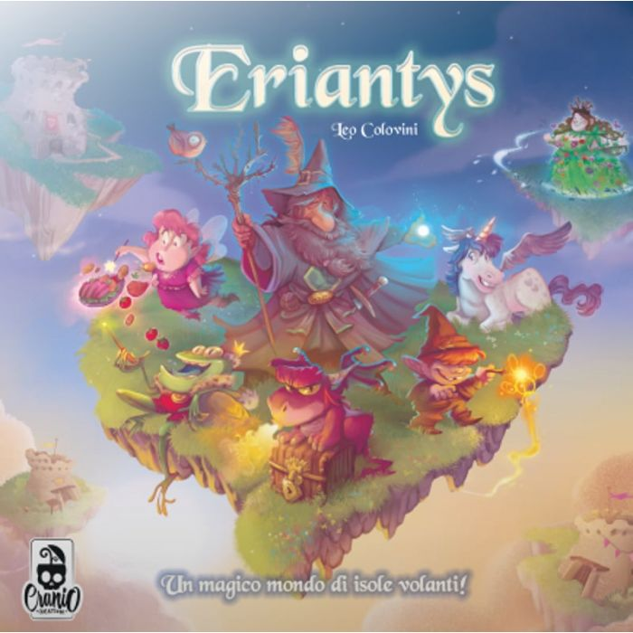
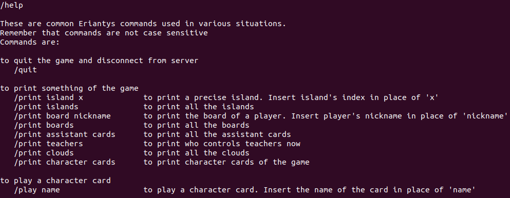
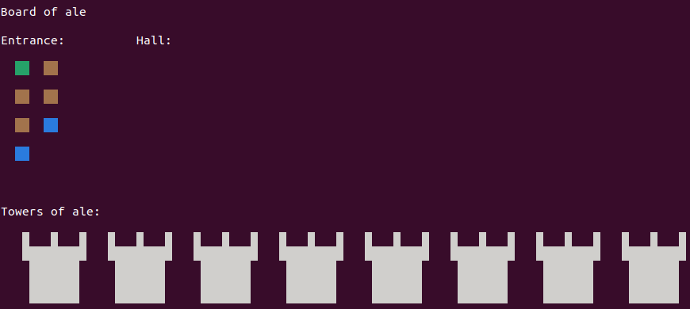
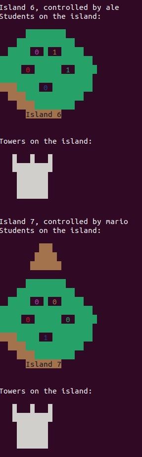
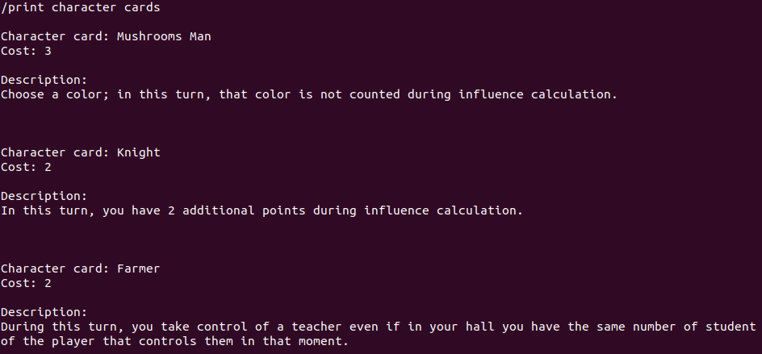

<a name="readme-top"></a>

[](https://www.java.com/it/)
[](https://www.jetbrains.com/idea/)


<!-- PROJECT LOGO -->
<br />
<div align="center">
  <a href="http://www.craniocreations.it/">
    
  </a>

<h3 align="center">Eriantys Board Game Implementation</h3>

  <p align="center">
    Eriantys Board Game - Software Engineering Final Project 2022 - Politecnico di Milano
  </p>
  <br />
</div>


<!-- ABOUT THE PROJECT -->
## Eriantys Board Game :dragon:

This is the final project of the Software Engineering course of the Bachelor's Degree at Politecnico di Milano. The course was held by Alessandro Margara.

The assignment of the project was to reproduce the *Eryantis* board game, created by Cranio Creations.

We had to develop the game exploiting the Model-View-Controller (MVC) pattern. Thus, we developed both basic and advanced rules of the game, the socket to allow communications between players connected to the game and the server, and the user interface in two versions: Command-Line Interface (CLI) and Graphical User Interface (GUI).

Images and brief descriptions of all the parts of the project will be provided.


 
| Functionality    |                       State                        |
|:-----------------|:--------------------------------------------------:|
| Basic rules      | ✅ |
| Complete rules   | ✅ |
| Socket           | ✅ |
| GUI              | ✅ |
| CLI              | ✅ |
| 12 Characters    | ✅ |
| Multiple games   | ❌ |
| Persistence      | ❌ |

For the additional functionalities, we decided to develop all the 12 character cards.

Other functionalities, such as concurrent multiple games and allowing the back up of the game after an undesired disconnection, have not been implemented.

<p align="right">(<a href="#readme-top">back to top</a>)</p>

## Implementation Details :dragon_face:

### Model

The model satisfies all the requirements of Eriantys, according to the rules of the board game.

Interesting choices done during the development of the project are:

* Introduction of [PlayerInteraction](src/main/java/it/polimi/ingsw/Model/Player/PlayerInteraction.java) and [IslandInteraction](src/main/java/it/polimi/ingsw/Model/Island/IslandInteraction.java): to distribute classes responsabilities, we decided to introduce these classes that will manage changes of the game state after interactions that involve the players and the islands, respectively. In this way, the [Model](src/main/java/it/polimi/ingsw/Model/Model.java) class is smaller and is not a god component.

* Usage of the decorator pattern to manage cards effects that work with the concept of influence (concept that belongs to the game): the pattern allowed us to exploit polymorphism in order to manage several cards effect in a more object oriented way. For more, involved classes can be found [here](src/main/java/it/polimi/ingsw/Model/Influence/).

* Usage of the state pattern to manage cards effects that involve the method of assignment of teachers to the players: the reason behind is choice is the same the one explained in the previous point. For more, involved classes can be found [here](src/main/java/it/polimi/ingsw/Model/Teacher/).

<p align="right">(<a href="#readme-top">back to top</a>)</p>

### Client-Server Communication

The communication is fully synchronous: every time that the server needs information from the players, he sends a message of the required type and keeps listening at the communication channel, waiting for a response that will change the state of the model, whose methods will be called from the controller when needed.

The server is a bit rudimentary, but it works. In more detail: every time a new client connects, the server creates a thread that will handle the user's join to the game, according to the number of players that are already connected: if the game has already started, the server communicates to the new client that the needed number of players has been already met; otherwise, he is added to the lobby, and eventually waiting for other users to join the game.

If you want more information about connection establishment, you can give a look to the [Server](src/main/java/it/polimi/ingsw/Server.java) class.

<p align="right">(<a href="#readme-top">back to top</a>)</p>

### Command-Line Interface (CLI)

As already mentioned above, we had to develop the game using the MVC pattern. In particular, we implemented the View as both Command-Line Interface (CLI) and Graphic User Interface (GUI).

First of all, to offer a better game experience, we introduced commands that allow the player to get information about the current status of the game, in all its components.

A summary of these special commands is given when the user types the `/help` command, which provides also a brief description of them:



Some of the most interesting support commands that we implemented are the following.

`/print board nickname`, that prints the towers and the students in both entrance and hall of the player named "nickname".

<div align="center">
  
</div>
  
`/print islands`, that prints the current status of all the islands, showing who is the owner, if there mother nature, the number of students of each color on it, and the number of towers placed by the owner after having conquered it.

<div align="center">
  
</div>

`/print character cards`, that is available only if the game is set to hard mode, otherwise game's rules say that there are no playable character cards. The command shows the name of the cards, their current cost of activation, and a description about what is their effect.

<div align="center">
  
</div>

<br />

If you want to see in a more technical way how CLI elaboration and printing methods are implemented, give a look to the [CLI](https://github.com/MarioCela/Eriantys_Board_Game_SE/blob/main/src/main/java/it/polimi/ingsw/Client/CLI/CLI.java) and [ClientPrinter](https://github.com/MarioCela/Eriantys_Board_Game_SE/blob/main/src/main/java/it/polimi/ingsw/Client/CLI/ClientPrinter.java) classes.

<p align="right">(<a href="#readme-top">back to top</a>)</p>


<!-- RUN -->
## Run

### JAR file

In order to open jar files, you need to have a JDK for java installed on your PC. **Pay attention** to the JDK version you have installed on your PC: the jar file is build using the 14th version, so to be able to run it you need an equivalent or higher version. To run the jar you have to go in the target directory and use this command:  
```java -jar AM05-1.0-SNAPSHOT-jar-with-dependencies.jar``` <p> **The jar file has to be downloaded from the [link](https://polimi365-my.sharepoint.com/:u:/g/personal/10680462_polimi_it/Ed2xABxEAOxLhCfPCKUHEVIBsf4S4F87e2pkwOHbYGWvow?e=Qhd5t4) in the "deliveries" folder and has to be locally put in the directory**</p>
  
**NB** The server always runs on **1234** port.

Now you're ready to play.  

### For command-line users

In order to enable the ANSI color view from **Windows** prompt interface, you may need to run as administrator the [.bat file](https://github.com/MarioCela/Eriantys_Board_Game_SE/blob/main/EnableAnsiCmd.bat) we provided before starting the game.  For a better experience as CLI users
we also recommend to choose a window-size first and not to change it for the rest of the game.

<p align="right">(<a href="#readme-top">back to top</a>)</p>


<!-- LICENSE -->
## License 📄

Distributed under the `MIT` License. See [LICENSE](https://github.com/MarioCela/Eriantys_Board_Game_SE/blob/main/LICENSE) for more information.

<p align="right">(<a href="#readme-top">back to top</a>)</p>


<!-- CONTACT -->
## Group Members 👥

* [Alessandro Calvi](https://github.com/alecalvi00): alessandro4.calvi@mail.polimi.it  
* [Mario Cela](https://github.com/MarioCela): mario.cela@mail.polimi.it  
* [Alberto Ceresoli](https://github.com/AlbertoCeresoli): alberto.ceresoli@mail.polimi.it  

<p align="right">(<a href="#readme-top">back to top</a>)</p>
